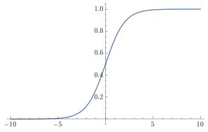

# Logistic regression

## Model

$g(z) = \frac{1}{1 - e^{-z}}$

$z = \vec w \cdot \vec x + b$

$f_{\vec w, b}(\vec x) = \frac{1}{1 - e^{-(\vec w \cdot \vec x + b)}}$

$f_{\vec w, b}(\vec x)$ outputs the probability of being 1

$f_{\vec w, b}(\vec x) = P(y = 1|\vec x; \vec w, b)$ where the right side of can be read as "the probability that $y$ is equal to $1$ given $x$ and with params $w$ and $b$".

For example:  
$x$ is tumor size
$y$ is either 0 (not malignant) or 1 (malignant)

$f_{\vec w, b}(\vec x) = 0.7$ means that the model predicts that there is 70% chance of $y$ being 1

## Decision boundary

When $z=0$, $y=0.5$

Is $f_{\vec w, b}(\vec x) \ge 0.5$?  
Yes, then $\hat{y} = 1$  
No, then $\hat{y} = 0$

When $f_{\vec w, b}(\vec x) \ge 0.5$?
> When $g(z) \ge 0.5$ but  
> $\implies z \ge 0$  
> $\implies \vec w \cdot \vec x + b \ge 0$  

> [!IMPORTANT]  
> Therefore,  
> $\hat{y} = 1$ when $\vec w \cdot \vec x + b \ge 0$  
> $\hat{y} = 0$ when $\vec w \cdot \vec x + b < 0$

